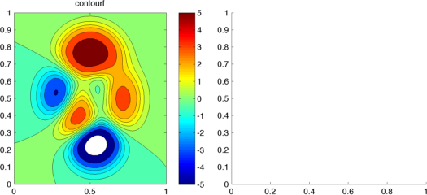
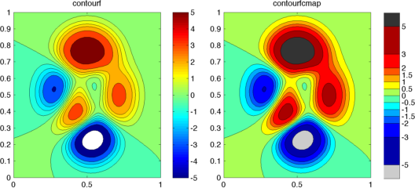
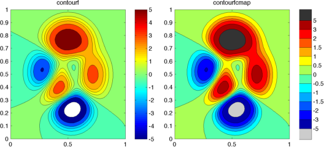
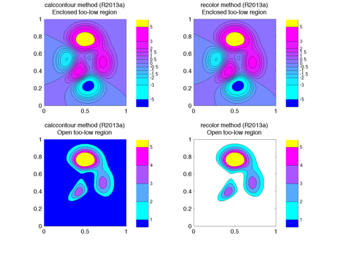
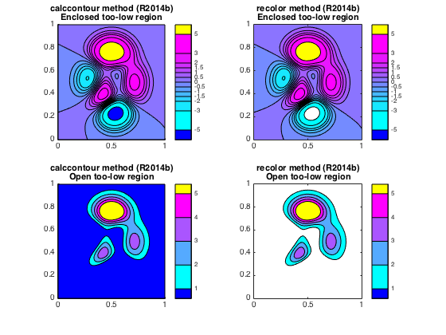

## contourfcmap.m Documentation

### Introduction

This function creates a shaded contour map, similar to that created by
the contourf function.  However, the relationship between a contourf plot
and its colormap (i.e. exactly which color corresponds to each contour
interval), can often be confusing and inconsistent, in my opinion.  This
function instead allows the user to specify exactly which colors to use
in each interval, and also to choose colors for regions that exceed the contour line limits.

### Update for 2014b

In the 2014b release, Matlab introduced new handle graphics objects (HG2).
Contour objects got a complete makeover with this update, and I
had to completely rewrite contourfcmap to accomodate these changes.  This version should support both pre- and post-HG2 versions of Matlab.  I now offer two different methods for coloring contours:

1. `recolor`: This is similar to the old pre-2014b version of contourfcmap, and is the default option.  It takes the existing contour objects and simply recolors the children patches (pre-2014b) or TriangleStrips (2014b+).  This method is quick, efficient, and requires no outside toolboxes.  But it has a few drawbacks:
  * It inherits some weaknesses from contourf itself in the way it handles regions lower than the lowest specified contour or higher than the highest specified contour.  Sometimes these regions are left empty, and whether or not the regions are shaded vary by Matlab release (see last example below).
  * In 2014b+, the recolor option has a tendency to get undone very easily.  Changing the colormap, adding a colorbar, and most frustratingly, printing figures to file (using anything that relies on the print command, including print, saveas, export_fig, etc) undoes it.  The only way I've found to save these figures is by doing a screenshot (i.e. `im = frame2im(getframe(gcf); imwrite(im, 'myfile.png', 'png')`).
  * Like contourf itself, the contour object handle returned by pre-2014b and 2014b+ are different classes (double contourgroup object vs graphics object Contour object) with different properties, and in some applications this inconsistency can make programming across Matlab versions difficult.
  * In 2014b+, I change a lot of undocumented properties, so this code could break in future updates.
2. `calccontour`: With this method, I calculate contour patches and lines from scratch, and plot these lines and patches in place of a contour object.  This method was originally added as a stopgap solution for the 2014b release, before I managed to explore the undocumented properties of the new contour objects.  It's more resource intensive than the original, and requires the Mapping Toolbox (for its many polygon-geometry-related functions), but it solves the problems encountered with the recolor method.

In addition to this change, I altered the calling syntax to use a parameter/value pair system, since the number of options has been steadily growing.  The old syntax should still work, though.

## Syntax
```
h = contourfcmap(x,y,z,clev,cmap,lo,hi,cbarloc)
h = contourfcmap(x,y,z,clev,cmap)
h = contourfcmap(x,y,z,clev,cmap,lo)
h = contourfcmap(x,y,z,clev,cmap,lo,hi)
h = contourfcmap(x,y,z,clev,cmap, 'param1', val1, ...)
```
See function help for description of input and output variables.

### Example


First we'll plot a contourf plot using the standard Matlab functions.
 

```matlab
% Data

[x,y] = meshgrid(linspace(0,1,100));
z = peaks(100);
clev = [-5 -3 -2:.5:2 3 5];

% Set up axes

h.fig = figure;
h.ax(1) = axes('position', [0.05  0.25 0.425 0.5]);
h.ax(2) = axes('position', [0.525 0.25 0.425 0.5]);

% Plot

axes(h.ax(1));
contourf(x,y,z,clev);
cb = colorbar('eastoutside');
colormap(h.ax(1), jet);
title(h.ax(1), 'contourf');
```



 Without labeling the contour lines, it's difficult to tell which values
 in the colorbar correspond to the color intervals in the contuorf plot.  Extreme values are misleading too... Is that entire dark red region exactly equal to 5, as implied by the colorbar?  What does white mean? Using contourfcmap, we can set the colors explictly, so it's much easier
 to tell exactly which color corresponds to which value, and which regions fall above or below the highest and lowest contour lines, respectively.

```matlab
axes(h.ax(2));
hc = contourfcmap(x,y,z,clev,jet(12), ...
     [.8 .8 .8], [.2 .2 .2], 'eastoutside');
title(h.ax(2), 'contourfcmap');           
```



 If you prefer, you can set the colorbar to show the contour intervals
 evenly-spaced, even if the values aren't.

```matlab
delete(hc.cbax);
set(h.ax(2), 'position', [0.525 0.25 0.425 0.5]);

hc = contourfcmap(x,y,z,clev,jet(12), ...
     [.8 .8 .8], [.2 .2 .2], 'eastoutside', true);
```


Finally, here's an example to show the potential differences between the two contour-creation methods with respect to coloring lower-than-lowest-contour regions.  In 2013a, contour objects only shade a too-low region if it's a closed polygon.  In 2014b, the region is never shaded.  With the calccontour method, the result is consistent (and in my opinion, correct) in both versions.

```matlab
v = ver('matlab');
v = regexprep(v.Release, '[\(\)]', '');

[x,y] = meshgrid(linspace(0,1,100));
z = peaks(100);
clev = [-5 -3 -2:.5:2 3 5];
cmap = cool(length(clev)-1);

clf;
ax(1) = subplot(2,2,1);
hh = contourfcmap(x,y,z,clev,cmap, ...
     'lo', [0 0 1], ...
     'hi', [1 1 0], ...
     'method', 'calccontour', ...
     'cbarloc', 'eastoutside');
title(ax(1), {sprintf('calccontour method (%s)', v), 'Enclosed too-low region'}); 
set(hh.cbax, 'fontsize', 8);
 
ax(2) = subplot(2,2,2);
hh = contourfcmap(x,y,z,clev,cmap, ...
     'lo', [0 0 1], ...
     'hi', [1 1 0], ...
     'cbarloc', 'eastoutside', ...
     'method', 'recolor');
title(ax(2), {sprintf('recolor method (%s)', v), 'Enclosed too-low region'}); 
set(hh.cbax, 'fontsize', 8);

clev = 1:5;
cmap = cool(length(clev)-1);

ax(3) = subplot(2,2,3);
hh = contourfcmap(x,y,z,clev,cmap, ...
     'lo', [0 0 1], ...
     'hi', [1 1 0], ...
     'method', 'calccontour', ...
     'cbarloc', 'eastoutside');
title(ax(3), {sprintf('calccontour method (%s)', v), 'Open too-low region'}); 
set(hh.cbax, 'fontsize', 8);
 
ax(4) = subplot(2,2,4);
hh = contourfcmap(x,y,z,clev,cmap, ...
     'lo', [0 0 1], ...
     'hi', [1 1 0], ...
     'cbarloc', 'eastoutside', ...
     'method', 'recolor');
title(ax(4), {sprintf('recolor method (%s)', v), 'Open too-low region'}); 
set(hh.cbax, 'fontsize', 8);
```




