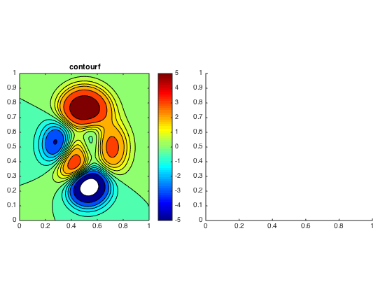
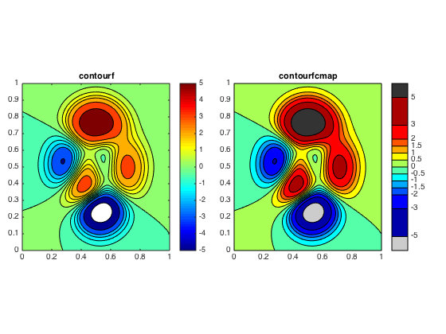
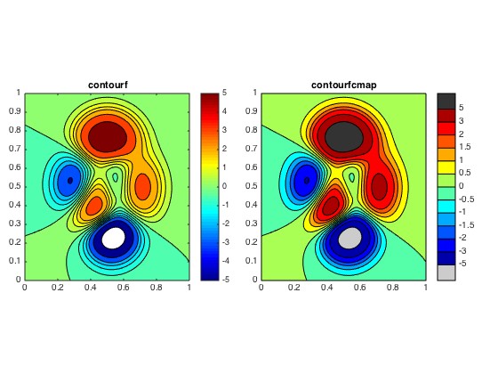

## contourfcmap.m Documentation

This function creates a shaded contour map, similar to that created by
the contourf function.  However, the relationship between a contourf plot
and its colormap (i.e. exactly which color corresponds to each contour
interval), can often be confusing and inconsistent, in my opinion.  This
function instead allows the user to specify exactly which colors to use
in each interval, and also to choose colors for regions that exceed the contour line limits.

## Syntax
```
h = contourfcmap(x,y,z,clev,cmap,lo,hi,cbarloc)
h = contourfcmap(x,y,z,clev,cmap)
h = contourfcmap(x,y,z,clev,cmap,lo)
h = contourfcmap(x,y,z,clev,cmap,lo,hi)
```
See function help for description of input and output variables.

### Example


 
 First we'll plot a contourf plot using the standard Matlab functions.
 

```matlab
% Data

[x,y] = meshgrid(linspace(0,1,100));
z = peaks(100);
clev = [-5 -3 -2:.5:2 3 5];

% Set up axes

h.fig = figure;
h.ax(1) = axes('position', [0.05  0.25 0.425 0.5]);
h.ax(2) = axes('position', [0.525 0.25 0.425 0.5]);

% Plot

axes(h.ax(1));
contourf(x,y,z,clev);
cb = colorbar('eastoutside');
colormap(h.ax(1), jet);
title(h.ax(1), 'contourf');
```



 Without labeling the contour lines, it's difficult to tell which values
 in the colorbar correspond to the color intervals in the contuorf plot.  Extreme values are misleading too... Is that entire dark red region exactly equal to 5, as implied by the colorbar?  What does white mean? Using contourfcmap, we can set the colors explictly, so it's much easier
 to tell exactly which color corresponds to which value, and which regions fall above or below the highest and lowest contour lines, respectively.

```matlab
axes(h.ax(2));
hc = contourfcmap(x,y,z,clev,jet(12), ...
     [.8 .8 .8], [.2 .2 .2], 'eastoutside');
title(h.ax(2), 'contourfcmap');           
```



 If you prefer, you can set the colorbar to show the contour intervals
 evenly-spaced, even if the values aren't.

```matlab
delete(hc.cbax);
set(h.ax(2), 'position', [0.525 0.25 0.425 0.5]);

hc = contourfcmap(x,y,z,clev,jet(12), ...
     [.8 .8 .8], [.2 .2 .2], 'eastoutside', true);
```

